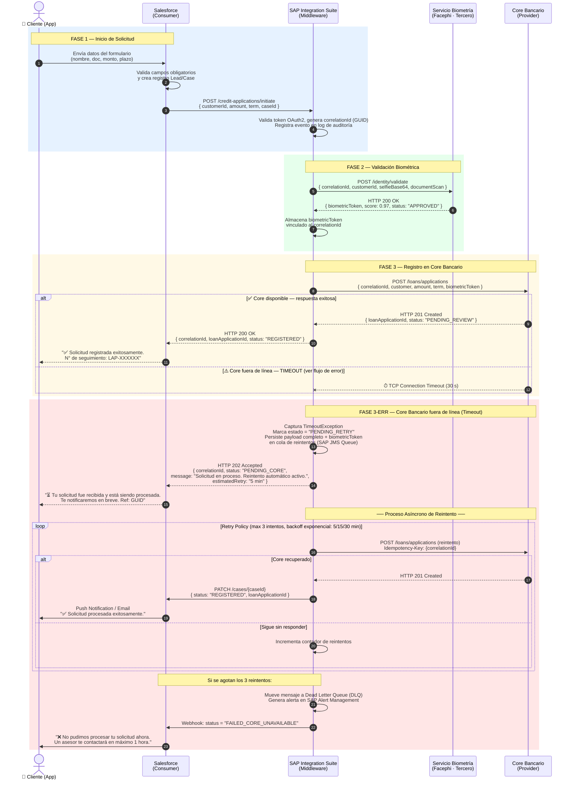

# Originación de Crédito Personal Digital
### Evaluación Técnica — Arquitectura de Integración Enterprise

---

## 📋 Índice

1. [Tarea 1 — Diagrama de Secuencia UML](#tarea-1--diagrama-de-secuencia-uml)
2. [Tarea 2 — Contrato de API (JSON + OpenAPI)](#tarea-2--contrato-de-api-json--openapi)
3. [Tarea 3 — Resolución de Bloqueo Técnico](#tarea-3--resolución-de-bloqueo-técnico)

---

## Tarea 1 — Diagrama de Secuencia UML

### Contexto del Flujo
El flujo orquesta cuatro actores: 

1.                 Salesforce (Consumer): Orquestador de la experiencia de usuario.

2.                 SAP Integration Suite (Middleware): Capa de abstracción y seguridad.

3.                 Servicio de Biometría (Tercero): Validación de identidad.

4.                 Core Bancario (Provider): Creación del registro de préstamo.


### Diagrama de Secuencia



### Decisiones de Diseño Clave

| Decisión | Justificación |
|---|---|
| **HTTP 202 Accepted** al cliente cuando el Core falla | No se bloquea la experiencia; el cliente obtiene confirmación inmediata |
| **Idempotency-Key = correlationId** en reintentos | Evita duplicados si el Core recibe la petición pero falla al responder |
| **biometricToken persistido en SAP** | El token de Facephi no expira antes del reintento; no hay que re-validar identidad |
| **Dead Letter Queue + Alerta** tras 3 reintentos | Permite intervención humana controlada sin pérdida de datos |
| **Backoff exponencial** (5/15/30 min) | Reduce la presión sobre el Core durante su recuperación |

---

## Tarea 2 — Contrato de API (JSON + OpenAPI)

### 2.1 Request Body — Creación de Solicitud de Crédito

Basado en el estándar **BIAN** (*Consumer Lending / Credit Application*) con campos mapeados a ISO 20022 donde aplica.

```json
{
  "creditApplicationRequest": {

    "transactionIdentification": {
      "globalTransactionId": "f47ac10b-58cc-4372-a567-0e02b2c3d479",
      "correlationId": "SF-CASE-00123456",
      "originatingSystem": "SALESFORCE_SERVICE_CLOUD",
      "requestTimestamp": "2025-07-10T14:32:00.000Z",
      "idempotencyKey": "f47ac10b-58cc-4372-a567-0e02b2c3d479"
    },

    "applicantParty": {
      "partyIdentification": {
        "fullLegalName": "María Fernanda López Ríos",
        "documentType": "CC",
        "documentNumber": "1023456789",
        "dateOfBirth": "1990-03-15",
        "nationality": "CO"
      },
      "contactInformation": {
        "email": "maria.lopez@email.com",
        "mobilePhone": "+573001234567"
      }
    },

    "creditArrangement": {
      "requestedAmount": {
        "value": 15000000,
        "currency": "COP"
      },
      "termInMonths": 36,
      "creditProductType": "PERSONAL_LOAN_UNSECURED",
      "requestedDisbursementDate": "2025-07-15"
    },

    "identityVerification": {
      "biometricToken": "eyJhbGciOiJSUzI1NiIsInR5cCI6IkpXVCJ9.eyJzdWIiOiIxMDIzNDU2Nzg5IiwiaWF0IjoxNzIwNjE3OTIwLCJleHAiOjE3MjA2MjE1MjAsInNjb3JlIjowLjk3LCJwcm92aWRlciI6IkZBQ0VQSEkifQ.SIGNATURE",
      "biometricProvider": "FACEPHI",
      "verificationScore": 0.97,
      "verificationTimestamp": "2025-07-10T14:30:45.000Z",
      "verificationStatus": "APPROVED"
    },

    "channelContext": {
      "channel": "MOBILE_APP",
      "deviceFingerprint": "a1b2c3d4e5f6",
      "ipAddress": "190.26.155.44",
      "userAgent": "BankApp/3.2.1 (Android 14; Samsung Galaxy S23)"
    }

  }
}
```

### 2.2 Validaciones de Tipos de Datos

| Campo | Tipo JSON | Restricción / Validación |
|---|---|---|
| `globalTransactionId` | `string` | Formato UUID v4 — `[0-9a-f]{8}-[0-9a-f]{4}-4[0-9a-f]{3}-[89ab][0-9a-f]{3}-[0-9a-f]{12}` |
| `requestTimestamp` | `string` | ISO 8601 con timezone — `date-time` |
| `documentType` | `string` | Enum: `["CC", "CE", "PASSPORT", "NIT"]` |
| `documentNumber` | `string` | String (no numérico) — soporta docs alfanuméricos |
| `value` (monto) | `number` | Mínimo: `500000` · Máximo: `200000000` · Sin decimales para COP |
| `currency` | `string` | ISO 4217 — 3 caracteres: `"COP"`, `"USD"` |
| `termInMonths` | `integer` | Enum: `[12, 24, 36, 48, 60]` |
| `verificationScore` | `number` | Rango: `0.0` a `1.0` — Umbral mínimo aprobatorio: `0.75` |
| `biometricToken` | `string` | JWT firmado — mínimo 100 caracteres |

---

### 2.3 Swagger / OpenAPI 3.0 — Header del Endpoint

```yaml
openapi: 3.0.3

info:
  title: Core Bancario — Credit Application API
  description: |
    API para la creación y gestión de solicitudes de crédito personal en el Core Bancario.
    Estándar base: BIAN v10 — Consumer Lending / Credit Application Procedure.
    Expuesta a través de SAP Integration Suite como capa de seguridad y abstracción.
  version: "1.0.0"
  contact:
    name: Arquitectura de Integración — Banco
    email: integraciones@banco.com
  license:
    name: Uso Interno — Confidencial

servers:
  - url: https://api-gw.banco.com/core/v1
    description: Producción
  - url: https://api-gw-sandbox.banco.com/core/v1
    description: Sandbox / QA

security:
  - OAuth2ClientCredentials: []

paths:
  /loans/applications:
    post:
      summary: Crear Solicitud de Crédito Personal
      description: |
        Registra una nueva solicitud de crédito en el Core Bancario.
        Requiere validación biométrica previa exitosa (biometricToken válido).
        Implementa idempotencia mediante el header `Idempotency-Key`.
      operationId: createCreditApplication
      tags:
        - Credit Applications
      parameters:
        - name: Idempotency-Key
          in: header
          required: true
          description: UUID v4 — mismo valor del globalTransactionId. Previene duplicados en reintentos.
          schema:
            type: string
            format: uuid
            example: "f47ac10b-58cc-4372-a567-0e02b2c3d479"
        - name: X-Correlation-Id
          in: header
          required: true
          description: ID de correlación para trazabilidad end-to-end (propagado desde Salesforce).
          schema:
            type: string
            example: "SF-CASE-00123456"
        - name: X-Channel
          in: header
          required: true
          description: Canal de originación de la solicitud.
          schema:
            type: string
            enum: [MOBILE_APP, WEB, BRANCH, CALL_CENTER]
      requestBody:
        required: true
        content:
          application/json:
            schema:
              $ref: '#/components/schemas/CreditApplicationRequest'
      responses:
        '201':
          description: Solicitud creada exitosamente en el Core.
          content:
            application/json:
              schema:
                $ref: '#/components/schemas/CreditApplicationResponse'
        '400':
          description: Error de validación — datos de entrada inválidos.
          content:
            application/json:
              schema:
                $ref: '#/components/schemas/ErrorResponse'
        '401':
          description: No autorizado — token OAuth2 inválido o expirado.
        '409':
          description: Conflicto — solicitud duplicada (mismo Idempotency-Key ya procesado).
        '503':
          description: Core Bancario no disponible — reintentar con backoff exponencial.

components:
  securitySchemes:
    OAuth2ClientCredentials:
      type: oauth2
      flows:
        clientCredentials:
          tokenUrl: https://auth.banco.com/oauth2/token
          scopes:
            loans:write: Crear solicitudes de crédito
            loans:read: Consultar solicitudes de crédito

  schemas:
    CreditApplicationRequest:
      type: object
      required:
        - transactionIdentification
        - applicantParty
        - creditArrangement
        - identityVerification
      properties:
        transactionIdentification:
          $ref: '#/components/schemas/TransactionId'
        applicantParty:
          $ref: '#/components/schemas/ApplicantParty'
        creditArrangement:
          $ref: '#/components/schemas/CreditArrangement'
        identityVerification:
          $ref: '#/components/schemas/IdentityVerification'

    TransactionId:
      type: object
      required: [globalTransactionId, requestTimestamp]
      properties:
        globalTransactionId:
          type: string
          format: uuid
        correlationId:
          type: string
        requestTimestamp:
          type: string
          format: date-time
        idempotencyKey:
          type: string
          format: uuid

    ApplicantParty:
      type: object
      required: [partyIdentification]
      properties:
        partyIdentification:
          type: object
          required: [fullLegalName, documentType, documentNumber]
          properties:
            fullLegalName:
              type: string
              minLength: 3
              maxLength: 150
            documentType:
              type: string
              enum: [CC, CE, PASSPORT, NIT]
            documentNumber:
              type: string
              minLength: 5
              maxLength: 20

    CreditArrangement:
      type: object
      required: [requestedAmount, termInMonths, creditProductType]
      properties:
        requestedAmount:
          type: object
          required: [value, currency]
          properties:
            value:
              type: number
              minimum: 500000
              maximum: 200000000
            currency:
              type: string
              pattern: '^[A-Z]{3}$'
        termInMonths:
          type: integer
          enum: [12, 24, 36, 48, 60]
        creditProductType:
          type: string
          enum: [PERSONAL_LOAN_UNSECURED, PERSONAL_LOAN_SECURED]

    IdentityVerification:
      type: object
      required: [biometricToken, biometricProvider, verificationStatus]
      properties:
        biometricToken:
          type: string
          minLength: 100
          description: JWT firmado emitido por el proveedor biométrico.
        biometricProvider:
          type: string
          enum: [FACEPHI, JUMIO, TRUORA]
        verificationScore:
          type: number
          minimum: 0.0
          maximum: 1.0
        verificationStatus:
          type: string
          enum: [APPROVED, REJECTED, MANUAL_REVIEW]

    CreditApplicationResponse:
      type: object
      properties:
        loanApplicationId:
          type: string
          example: "LAP-2025-0078432"
        correlationId:
          type: string
        status:
          type: string
          enum: [PENDING_REVIEW, APPROVED, REJECTED]
        createdAt:
          type: string
          format: date-time

    ErrorResponse:
      type: object
      properties:
        errorCode:
          type: string
        errorMessage:
          type: string
        correlationId:
          type: string
        timestamp:
          type: string
          format: date-time
```

---

## Tarea 3 — Resolución de Bloqueo Técnico

### Situación
> *"El equipo de desarrollo reporta que no puede conectarse al ambiente de Sandbox del Core Bancario desde SAP Integration Suite, recibiendo un error `Connection Refused`."*

### Las 3 Validaciones Técnicas (en orden de probabilidad y velocidad de resolución)

---

#### ✅ Validación 1 — Conectividad de Red y Firewall (Capa de Infraestructura)

**Qué valido:**
- Ejecutar un `telnet` o `curl` directo desde el servidor SAP hacia el host/puerto del Core Bancario Sandbox:
  ```bash
  # Desde el servidor SAP Integration Suite:
  telnet sandbox-core.banco.com 8443
  curl -v --connect-timeout 10 https://sandbox-core.banco.com/api/health
  ```
- `Connection Refused` (TCP RST inmediato) indica que el puerto **está cerrado o bloqueado** en firewall/SG — distinto a `Connection Timed Out` que indica que el paquete nunca llega.
- Verificar si la IP pública/privada del SAP está en la whitelist del ambiente Sandbox del Core.

**Con quién coordino:** Equipo de **Infraestructura / Redes** (apertura de reglas de firewall, Security Groups en cloud, ACLs) + equipo del **Core Bancario** (confirmación del puerto correcto y estado del servicio).

---

#### ✅ Validación 2 — Configuración del Endpoint en SAP Integration Suite

**Qué valido:**
- Revisar el **Integration Flow / iFlow** en SAP Cloud Integration: URL del receptor, puerto, protocolo (HTTP vs HTTPS), y contexto de ruta base (`/api/v1` vs `/core/v1`).
- Verificar que las **credenciales del Security Material** (certificados TLS, usuario técnico) apunten al ambiente correcto — es común que Sandbox tenga certificados auto-firmados que requieren importar el CA root en el *JKS (Java KeyStore)* de SAP.
- Confirmar que la URL del Sandbox no fue cambiada recientemente (rotación de ambientes, nuevo hostname):
  ```
  # Ejemplo de error silencioso frecuente:
  PRODUCCIÓN: https://core.banco.com:8443
  SANDBOX:    https://sandbox-core.banco.com:8444  ← puerto diferente
  ```

**Con quién coordino:** Equipo de **SAP Basis / SAP Integration** (configuración interna) + proveedor del **Core Bancario** (documentación actualizada del ambiente Sandbox).

---

#### ✅ Validación 3 — Estado del Ambiente Sandbox del Core Bancario

**Qué valido:**
- Confirmar que el servicio destino **está levantado**. Un `Connection Refused` puede originarse porque el proceso servidor (ej. Tomcat, JBoss, MuleSoft) no está corriendo en el Sandbox:
  ```bash
  # En el servidor del Core Sandbox (si tenemos acceso):
  netstat -tlnp | grep 8443
  systemctl status core-bancario-sandbox
  ```
- Revisar si el ambiente Sandbox tiene **horario de disponibilidad** (algunos ambientes no productivos se apagan fuera de horario laboral o en fines de semana).
- Verificar si hay un **mantenimiento programado** o si el ambiente fue re-aprovisionado y el endpoint cambió.

**Con quién coordino:** Equipo de **Operaciones TI del Core Bancario** (levantar el servicio) + **Gestión de Ambientes / DevOps** (estado y disponibilidad del Sandbox).

---

### Resumen Ejecutivo de Coordinación

```
┌──────────────────────┬─────────────────────────────────────┬──────────────────────────┐
│ Validación           │ Área a Coordinar                    │ Tiempo Estimado          │
├──────────────────────┼─────────────────────────────────────┼──────────────────────────┤
│ 1. Red / Firewall    │ Infraestructura / Redes + Core Team │ 30 min – 2 h             │
│ 2. Config SAP        │ SAP Basis / Integration + Core Team │ 15 – 45 min              │
│ 3. Estado Sandbox    │ Operaciones TI Core / DevOps        │ 15 min (si está caído)   │
└──────────────────────┴─────────────────────────────────────┴──────────────────────────┘
```

> 💡 **Acción inmediata recomendada:** Iniciar con la Validación 3 (¿está el servicio vivo?) en paralelo con la Validación 1 (¿hay conectividad?). Son las más rápidas de descartar y cubren el 80% de los casos de `Connection Refused`.

---

## 🛠️ Stack Tecnológico del Ejercicio

| Componente | Tecnología |
|---|---|
| Orquestador UX | Salesforce Service Cloud |
| Middleware / ESB | SAP Integration Suite (Cloud Integration) |
| Biometría | Facephi (SDK + REST API) |
| Core Bancario | Sistema legado con API REST expuesta |
| Estándar de Contrato | BIAN v10 + ISO 20022 (campos de identificación) |
| Seguridad | OAuth 2.0 Client Credentials + TLS 1.2+ |
| Resiliencia | Retry con backoff exponencial + Dead Letter Queue |

---

*Documento elaborado como respuesta a evaluación técnica de Arquitectura de Integración Enterprise.*
